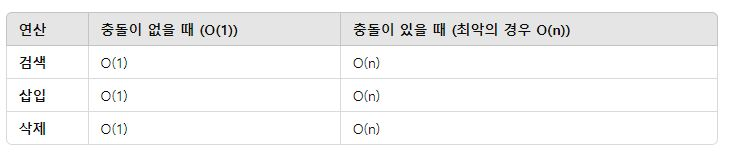
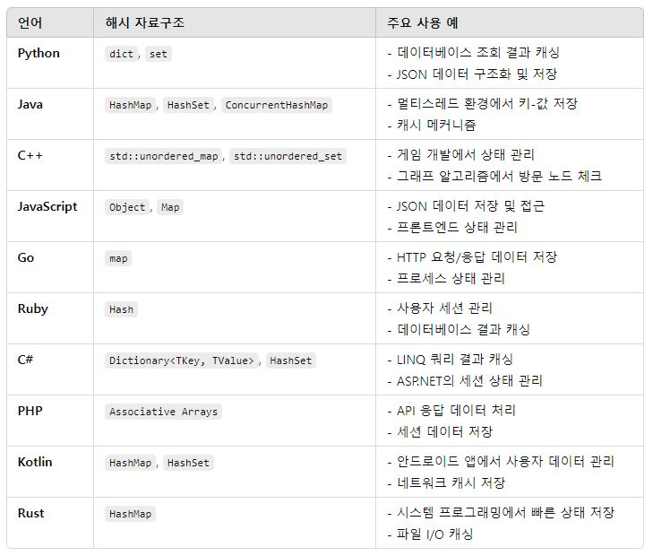

# 💥해시 (Hash)
- 해시는 임의의 길이를 갖는 데이터를 고정된 크기의 값으로 매핑하는 과정 또는 그 과정에서 사용되는 함수를 의미
- 간단히 말하면, 데이터를 빠르게 찾기 위한 방법

## 해시 함수
####  1. **고정된 출력 크기**
   - 해시 함수는 입력값이 크기에 관계없이 고정된 크기의 출력값을 생성
#### 2. **빠른 계산**
   - 해시 함수는 입력값을 받아서 해시값을 출력하는 데 매우 빠르게 계산할 수 있어야 함
#### 3. 충돌(Collision)이 적어야 함
  - 서로 다른 두 입력이 같은 해시값을 가질 가능성을 줄여야 함

#### 4. 해시 함수의 예
- MD5, SHA-1, SHA-256 등은 암호학에서 많이 사용되는 해시 함수

## 해시 테이블
- 데이터를 저장할 때 해시 함수에 의해 생성된 값을 인덱스로 사용하여 데이터를 저장하는 자료구조 
- 빠른 검색, 삽입, 삭제가 가능

## 해시 테이블의 충돌 해결 방법
1. 체이닝(Chaining)
   - 해쉬 테이블 저장공간 이외의 공간을 활용하는 기법
   - 충돌이 발생하면, 해당 인덱스에 리스트를 연결하여 데이터를 추가
2. 오픈 어드레싱(Open Addressing)
   - 충돌이 발생하면, 빈 슬롯을 찾아 데이터를 삽입하는 방식

## 해시 테이블의 시간 복잡도

## 언어 별 사용

